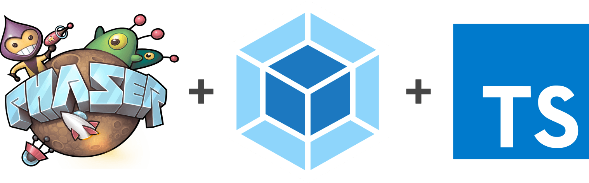

# 🕹️ Phaser 3.60, Webpack 5, and TypeScript template

## How To Use

```bash
# Install dependencies
$ npm install

# Run webpack-dev-server with development configuration,
# source maps, and live reloading. Opens the game automatically
# in a browser when run. Very useful for rapid development.
$ npm run start

# Run webpack command with development configuration.
# Development build is output in dist/ folder.
$ npm run build:dev

# Run webpack command with production configuration.
# Production build is output in dist/ folder.
$ npm run build:prod

# Run ESLint command which lists coding style problems.
$ npm run eslint

# Run ESLint command which automatically fixes
# coding style problems and lists unsolvable ones.
$ npm run eslint:fix
```
